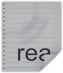

# 一些有用的markdown技巧

## 控制图片的大小和位置

**图片默认显示效果：**



**加以控制后的效果：**

<div align="center"></div>

## 换行

可以直接用`<br>`来控制换行

## 生成目录树

使用`tree`命令
忽略某些项：tree -I
只打印某些项： tree -P

## Task示例

- [ ] Eat
- [x] Code
  - [x] HTML
  - [x] CSS
  - [x] JavaScript
- [ ] Sleep

## 页内跳转实现

**先定义一个锚(id)**

<span id="jump">Hello World</span>

```html
<span id="jump">Hello World</span>
```

***
***
***
***
***
**然后使用markdown的语法:**

[跳转到Hello World](#jump)

```markdown
[跳转到Hello World](#jump)
```

## markdown表格

| 左对齐标题 | 右对齐标题 | 居中对齐标题 |
| :------| ------: | :------: |
| 短文本 | 中等文本 | 稍微长一点的文本 |
| 稍微长一点的文本 | 短文本 | 中等文本 |

`markdown语法：`

```markdown
| 左对齐标题 | 右对齐标题 | 居中对齐标题 |
| :------| ------: | :------: |
| 短文本 | 中等文本 | 稍微长一点的文本 |
| 稍微长一点的文本 | 短文本 | 中等文本 |
```

`语法说明：`

1. `|、-、:`之间的多余空格会被忽略，不影响布局。
2. 默认标题栏居中对齐，内容居左对齐。
3. `-:`表示内容和标题栏居右对齐，`:-`表示内容和标题栏居左对齐，`:-:`表示内容和标题栏居中对齐。
4. 内容和`|`之间的多余空格会被忽略，每行第一个`|`和最后一个`|`可以省略，-的数量至少有一个。

## 数学公式

单独行公式使用`$$ $$`包裹，行内公式使用`$ $`包裹。

基本的求和公式以及上下标：

$$\sum\nolimits_{i=1}^nNeed_i^2<n$$

```markdown
$$\sum\nolimits_{i=1}^nNeed_i^2<n$$
```

